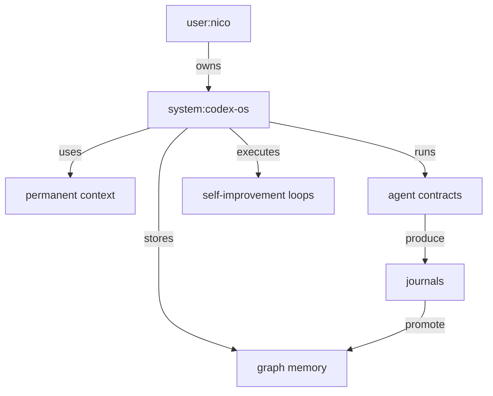

# Architecture

Codex-OS has five layers.

## 1. Permanent Context

Stable user and system instructions that should be read before strategic work.

## 2. Protocols

Reusable operating rules for approval, memory, delegation, and review.

## 3. Agents

Role contracts for core agents and sub-agents. These are readable by Codex and portable across projects.

## 4. Memory

Raw journals plus graph-shaped durable memory. JSONL keeps appends easy and audit-friendly.

## 5. Integrations

Adapters for MCP, GitHub, calendar, email, browser, local files, and future automations.

## Initial Graph Model

